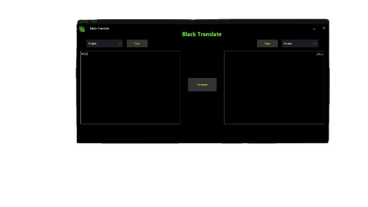

# [Black-Translate](https://github.com/black-software-com/black-translate)

<center>
<a href="https://github.com/black-software-com/black-translate" title="Black-Translate Logo" alt="Black-Translate Logo">
</a>
</center>
<hr>

## Scr


| Files | Version | Windows | Linux | MacOS |
:-----:|:-------:|:-------:|:------:|:------:|
[Black-Translate](https://github.com/black-software-com/black-translate) | v1.0 | ✅ | ✅ | ✅ |
<br>
---
## Installing:
**Installing For Linux And MacOS**
``` sh
git clone https://github.com/black-software-com/black-translate

cd black-translate

bash install.sh

./black
```
<br>

**Installing For Windows**
``` txt
First Installing Python

Second Installing Black-Translate Zip File

And Black-Translate Extract Files

open cmd

go to the Black-Translate Directory

Usage: python black
```
<br>

### Installing Files:

[Black-Translate](https://github.com/black-software-Com/black-translate/archive/refs/heads/master.zip)

[Python](https://www.python.org/ftp/python/3.10.2/python-3.10.2-amd64.exe)

### Black-Software Social Network

[Black-Software Web](http://blacksoftwarecompany.com)

[Github](https://github.com/black-software-com)

[Instagram](https://instagram.com/black_software_company)

[Telegram](https://t.me/blacksoftware3)

[Twitter](https://twitter.com/blacksoftware3)

[Zlink](https://zil.ink/blacksoftware)
<br>
